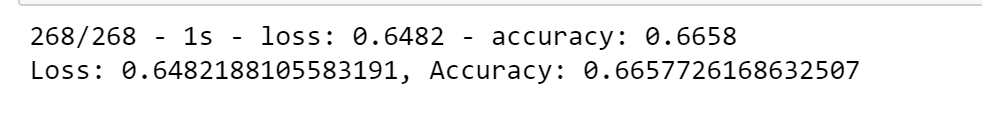
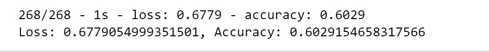
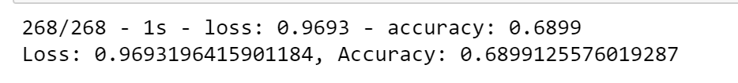
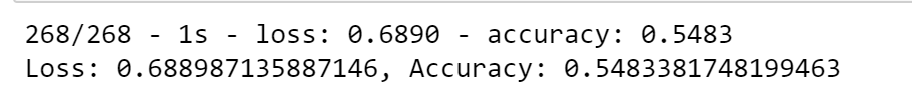
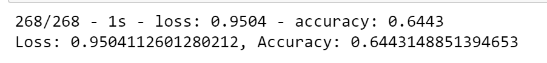

# Neural Network Charity Analysis

The President of the nonprofit foundation Alphabet Soup has asked their Data Engineer to predict which organizations are worth donating to or which are too high risk. They have raised and donated over 10 billion dollars over the past 20 years, while most of their donations have been impactful and put to good use, some organizations disappear after receiving the money. He has asked her to come up with a mathematical data driven solution that can do this accurately. The Data Engineer, Beks, has decided this is too complex for the machine learning models she’s used. Instead, she has decided to design and train a deep learning neural network model that evaluates all types of input data.

Since the organizations must apply to receive the donations, Beks and I have created a binary classifier that can predict whether applicants will be successful if funded. The business team has provided a CSV with more than 34,000 organizations that have received funding over the years that we will use to train the model.

## Results

**Data Preprocessing**
- What variable(s) are considered the target(s) for your model?
  - The target for this model was the "IS_SUCCESSFUL" column in the dataset.
- What variable(s) are considered to be the features for your model?
  - The features were columns: "APPLICATION_TYPE", "AFFILIATION", "CLASSIFICATION", "USE_CASE", "ORGANIZATION", "STATUS", "INCOME_AMT", "SPECIAL_CONSIDERATIONS", "ASK_AMT"
- What variable(s) are neither targets nor features, and should be removed from the input data?
  - The variables and EIN and Name are neither targets or features.

**Compiling, Training, and Evaluating the Model**
- How many neurons, layers, and activation functions did you select for your neural network model, and why?
  - Optimization 2 was my best performing model. It contained 3 layers with 2 hidden layers and the output layer. Layer 1 had 160 nodes and layer 2 had 60 nodes with ReLU as the activation function. In the first optimization, I felt that the accuracy performance took too much of a hit when I changed the activation function to tanh for the hidden layers so I transitioned back to ReLU and decided to try doubling the nodes and reducing the epochs to 10 rather than 25.
- Were you able to achieve the target model performance?
  - After four optimization attempts, I was not able to reach the target model performance.
- What steps did you take to try and increase model performance?
  - **Optimization 1:** I changed the activation function for layer 1 and 2 to tanh and reduced epochs to 25, everything else remained the same.
  - **Optimization 2:**  Activation functions were changed back to ReLU for layer 1 and 2, and doubled the nodes in both layers 1 and 2 and reduced the epochs to 10 in attempt to avoid overfitting.
  - **Optimization 3:** For this round I added an additional hidden layer. Layer 1 had 80 nodes, layer 2 had 30 nodes and layer 3 had 20 nodes, everything else remained the same.
  - **Optimization 4:** This was not required of me, I wanted to try one more time to see if I could get closer to the target performance. For this layer I reverted settings back to 2 hidden layers with 80 and 30 nodes respectively, activation functions for those layers were ReLU and trained for 10 epochs. For this time I changed the features and also removed the "STATUS" column.

**Original Model**

**Optimization 1**

**Optimization 2**

**Optimization 3**

**Optimization 4**

## Summary
Have developing and training the model, it only had a performance accuracy of 66.6%. I went through four iterations to try and optimize the model to achieve better performance. The model performed best when the number of nodes were doubled and epochs reduced however, accuracy was only increased to 70%, while better, it still wasn't quite out the desired target of 75%. I made a couple of other attempts, but they were not as successful as the second optimization. If time allows, I think this may be a desirable model to explore further to increase the accuracy, possibly by removing additional columns for the features, such as the "STATUS" column. We may also be able to decrease the epochs 1 or 2 to avoid potential overfitting. If these next steps do not improve performance I believe that the random forest model may be the next model to try since it too can deliver greater accuracy.
